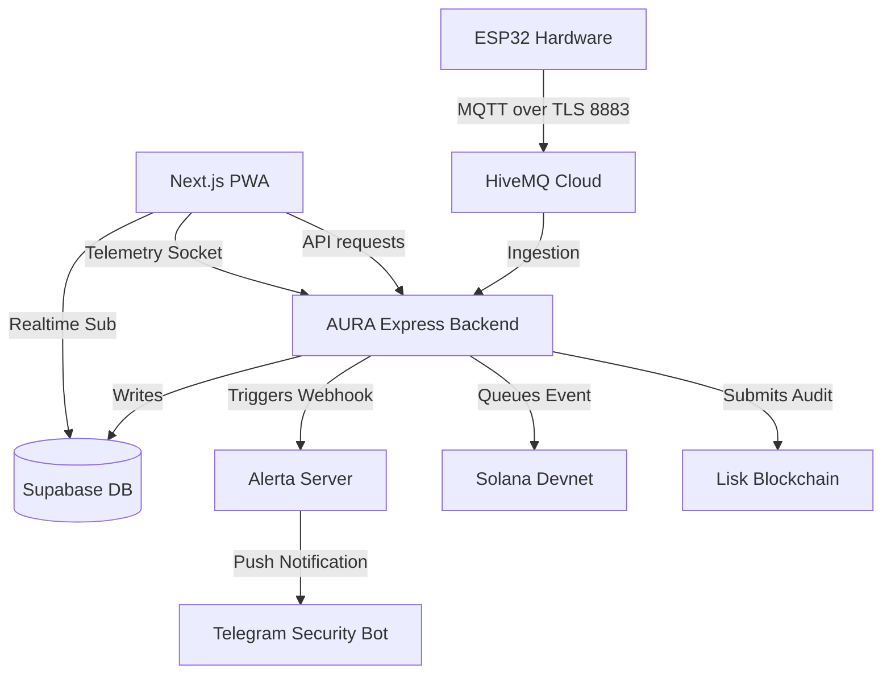

# AURA — Creator's Under-The-Hood Technical Guide

This guide is designed for you, the creator and presenter of AURA, to explain how the entire system functions technically, how data flows under the hood, and how to configure and run simulations for live demonstrations.

---

## 1. System Architecture & Component Mapping

AURA is split into three main packages/layers:
1. **Frontend PWA (Next.js 16 + Tailwind v4)**: Located in `frontend/`. Communicates with the Express backend via REST API and WebSockets.
2. **Backend Server (Node.js/TypeScript/Express)**: Located in `backend/`. Handles MQTT ingestion, real-time WebSockets, notifications (FCM + Resend), Alerta synchronization, and blockchain indexing.
3. **Database (Supabase PostgreSQL)**: Located on Supabase. Uses Row-Level Security (RLS) to restrict users to their own data, while letting the backend bypass RLS using the `SUPABASE_SERVICE_KEY` for high-throughput sensor writes.

---

## 2. In-Depth Subsystems

### 🔌 A. IoT Telemetry & MQTT Communication
The ESP32 microcontroller publishes JSON payloads to the HiveMQ Cloud broker over TLS port 8883.
- **Outbound Topics**:
  - `aura/<deviceId>/readings` (QoS 1): High-frequency voltage, current, and anomaly data.
  - `aura/<deviceId>/surge` (QoS 1): Instant warning of overvoltage/overcurrent.
  - `aura/<deviceId>/presence` (QoS 1): State of PIR sensor (occupied/unoccupied).
  - `aura/<deviceId>/heartbeat` (QoS 0): Uptime stats published every 30s. If a heartbeat is missed for >90s, the backend declares the device **offline**.
- **Inbound Commands**:
  - `aura/<deviceId>/cmd` (QoS 1): The backend publishes control instructions (e.g., `"command": "relay_off"`) to control the ESP32's relays.

### ⛓️ B. On-Chain Ledger Verification
AURA implements a dual-blockchain logging design:
1. **Solana Devnet (Real-Time Proofs)**:
   - When a device is paired, the backend mints a unique **Solana NFT** representing that hardware node using Metaplex.
   - For every critical incident (surge, intrusion, manual cutoff), the backend adds the event to a queue, signs a Devnet transaction with the system's keypair, and saves the transaction signature in the database.
   - The frontend queries the signature and displays a block explorer link to verify the proof.
2. **Lisk Blockchain (Monthly Compliance audits)**:
   - At the end of each month, threat counts, power parameters, and health percentages are compiled into a report.
   - The backend hashes the report and writes this cryptographic digest to Lisk, confirming monthly audit compliance.

### 🚨 C. Alerta & Telegram Integration
- **Incident Escalation**: When a threat is detected, the backend calls the Alerta API, raising an incident.
- **Telegram Routing**: Alerta is configured to trigger a webhook that posts to a Telegram channel. During simulations, you will receive a Telegram message detailing the node name, type of threat, and whether the relays were shut down.
- **HMAC Verification**: The backend has a webhook endpoint (`/alerta/webhook`) configured to receive status changes from Alerta (e.g., when a coordinator acknowledges an alert), verifying the request's authenticity using HMAC signatures.

---

## 3. Mock vs Real Integrations Toggle

To allow seamless development and testing when offline or without a physical robot:
- **Backend Mock Toggle**: Controlled by the `MOCK_INTEGRATIONS` variable in `.env`.
  - When `true`: The MQTT listener and Solana ledger queues are disabled, allowing the server to boot without credentials. The simulation endpoints will generate mock signatures.
  - When `false`: Full connectivity is established with HiveMQ, Solana Devnet, and Lisk.
- **Frontend Mock Toggle**: Controlled by `NEXT_PUBLIC_USE_MOCK_DATA` in `frontend/.env.local`.
  - When `true`: The frontend displays pre-seeded mock devices and sensor values.
  - When `false`: The frontend queries the actual backend REST API. If the API fails, it gracefully falls back to mock data to prevent app crashes.

---

## 4. Live Demonstration Workflow

Follow these steps to demonstrate the entire ecosystem to judges:

1. **Sign In with Wallet**:
   - Open the PWA, click "Connect Phantom Wallet" and approve the transaction signature request.
2. **Register a Simulated Node**:
   - Go to the **Devices** page. Click "Register Device", check "Provision Simulated Node", and click Register.
   - This registers a device in the database, unblocking all backend metrics.
3. **Simulate a Threat (Surge Event)**:
   - Go to the **Settings** page. Scroll to the **System Simulator Suite**.
   - Select your registered node and click **Simulate Surge**.
   - **Observe**:
     - A success toast appears.
     - A Telegram notification pops up from the Telegram Bot.
     - Go to the **Dashboard** or **Monitor** and see the flashing red **LOCKDOWN / SURGE DETECTED** alert banner.
     - Go to the **Event Log** and check the new entry showing a **Verified Solana Proof** transaction.
4. **Simulate an Audit**:
   - Click **Simulate Audit** in the Simulator Suite.
   - **Observe**:
     - The monthly compliance report is generated, hashed, and signed.
     - The audit record appears on the **Reports** page showing the Lisk confirmation status.
